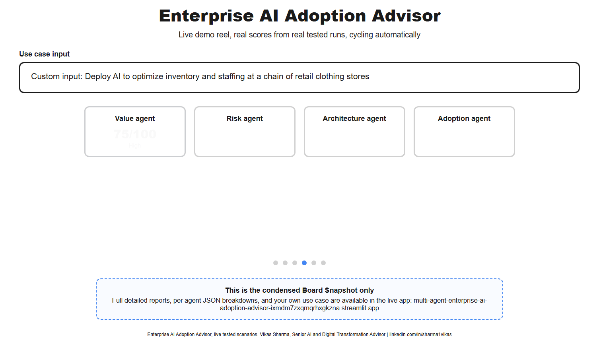
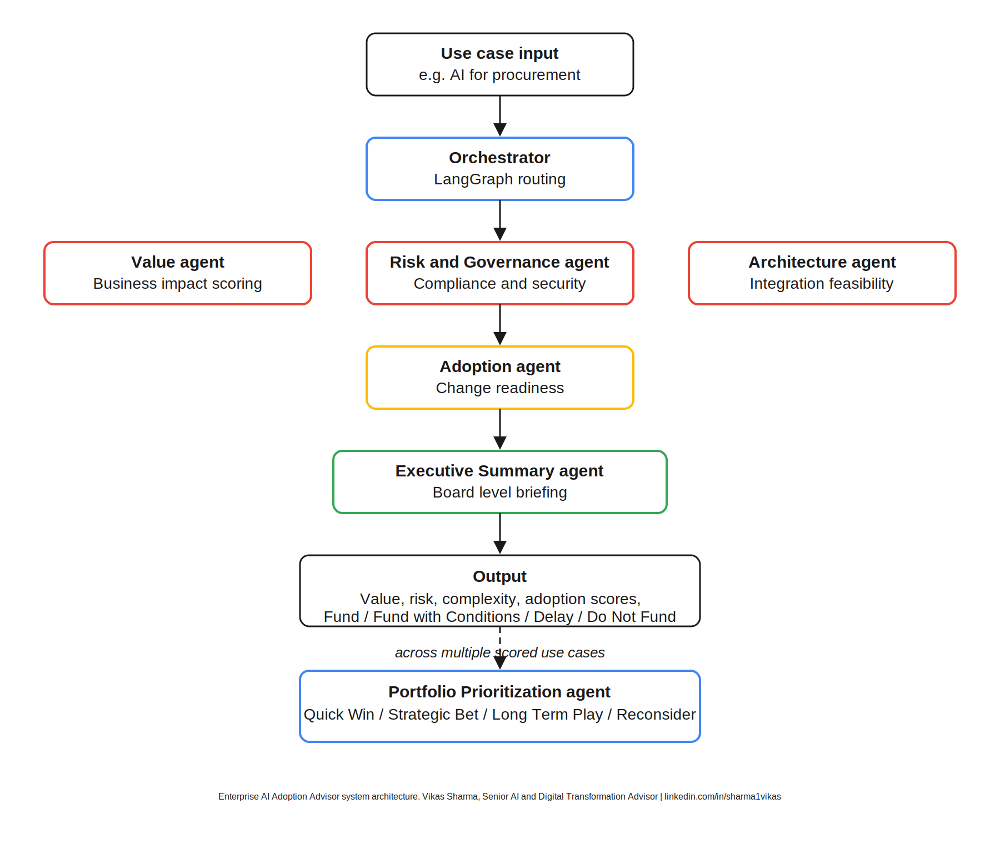

# Enterprise AI Adoption Advisor

A multi agent executive decision support framework for prioritizing enterprise AI investments.

Evaluate enterprise AI use cases across five dimensions that actually determine whether an initiative succeeds after approval, not just whether it sounds promising in a slide.

Business Value, Risk and Governance, Technical Feasibility, Organizational Readiness, Portfolio Priority

Built by Vikas Sharma, Senior AI and Digital Transformation Advisor.

Live app: https://multi-agent-enterprise-ai-adoption-advisor-ixmdm7zxqmqrhxgkzna.streamlit.app
Source: github.com/net2user/Multi-Agent-Enterprise-AI-Adoption-Advisor

A full animated version of the demo reel above, cycling through six real tested scenarios with genuine scores, is available at docs/demo_reel.html. Download it and open it directly in any browser to see it run, GitHub does not execute the embedded animation script inline, so the GIF above is the version that plays right here on this page.

## Status

Complete and working end to end, live and deployed.

Done: Value agent, Risk and Governance agent, Architecture agent, Adoption agent, Portfolio Prioritization agent, Executive Summary agent, LangGraph orchestrator wiring all five agents together, Streamlit frontend deployed publicly with two tabs, Single Use Case and Portfolio View, tested across three calibrated domains, three adversarial robustness scenarios, and a full eight use case portfolio ranking run.
Nothing is currently in progress. Optional next steps under consideration include a bring your own API key option and a cleaner custom app URL.

## Problem statement

Organizations across BFSI and Healthcare now have more AI use case ideas than they have capacity to evaluate. The gap is not idea generation, it is disciplined assessment. Most organizations lack a repeatable way to compare a fraud detection use case against a clinical documentation use case on equal footing, across value, risk, feasibility, and organizational readiness, and to turn that comparison into a defensible roadmap a board can act on.

This system addresses that gap directly. Feed it a single use case description, or a portfolio of them, and it returns a structured assessment covering the dimensions that actually determine whether an AI initiative succeeds after approval.

## Example output

Use case: AI assisted procurement operations for indirect spend, the flagship case used throughout this repository.

Value Score: 78, High
Risk Score: 42, Moderate
Complexity Score: 68, High
Adoption Score: 68, High

Recommendation: Fund with Conditions

This is a genuine, repeatedly tested result, not an illustrative placeholder, see the samples folder and the Evaluation framework section below for the full detail.

## Business context

The assessment logic here reflects patterns seen across twenty five years of enterprise AI and digital transformation advisory work in BFSI, Healthcare, Telecom, and Public Sector settings. The agents are calibrated with a synthetic but realistic portfolio of eight BFSI and Healthcare use cases, covering procurement, KYC, claims fraud, clinical documentation, prior authorization, and lending, so the scoring reflects real regulatory and operational texture rather than generic assumptions.

## Architecture

A single use case input flows through an orchestrator built on LangGraph. The orchestrator routes the input sequentially through four specialist agents, Value, Risk and Governance, Architecture, and Adoption, each producing an independent structured assessment. Once all four complete, their outputs feed into the Executive Summary agent, which synthesizes them into one board level recommendation. The Portfolio Prioritization agent runs separately, ranking multiple already scored use cases against each other rather than evaluating any single one from scratch.

All five agents run on Groq's Llama 3.3 70B model rather than OpenAI, a deliberate choice made during the build to keep the project genuinely free to run and test, with no billing dependency for anyone cloning the repository to try it themselves.

## Agent design

Each agent is a focused LLM call with a strict JSON output schema, not a general purpose chatbot wrapped in a persona. This keeps outputs composable, so the orchestrator and the Streamlit dashboard can render structured scores rather than parsing free text.

Value agent evaluates expected business impact, returning a value score, tier, estimated annual value range, and the specific drivers behind the number.

Risk and Governance agent evaluates compliance, security, privacy, and operational risk, returning a risk score, a breakdown across those four categories, and required mitigations.

Architecture agent evaluates integration complexity and technical feasibility, returning a complexity score, integration challenges, a recommended architecture pattern, and a build versus buy recommendation.

Adoption agent evaluates organizational readiness, the dimension most AI post mortems point to when a technically sound project fails anyway, returning an adoption score, readiness factors, and concrete change management actions.

Portfolio Prioritization agent takes the four scores above across multiple use cases and reasons about sequencing, labeling each use case a Quick Win, Strategic Bet, Long Term Play, or Reconsider.

Executive Summary agent reads all four completed assessments for a single use case and writes the board level call, a clear Fund, Fund with Conditions, Delay, or Do Not Fund recommendation, a one sentence headline, a briefing paragraph, and the key tension a board member needs to weigh.

## Data flow

Input is a plain text use case description, optionally paired with portfolio context, sector, domain, estimated cost, data sensitivity, regulatory exposure, current process maturity. Each agent reasons independently and returns its own structured JSON. The orchestrator collects Value, Risk, Architecture, and Adoption results, then passes all four into the Executive Summary agent for synthesis.

## Prompt design

Every agent prompt follows the same structure, a role definition anchoring the agent as a senior domain specialist, an explicit input contract, a strict output JSON schema, and numeric scoring bands with concrete criteria for each band, so scores are reproducible rather than arbitrary.

## Evaluation framework

The system was tested against three use cases spanning two sectors, UC-001, indirect spend procurement in BFSI, UC-002, automated KYC document verification in BFSI, and UC-004, ambient clinical documentation in Healthcare.

Results confirmed the agents differentiate correctly rather than returning similar scores regardless of input. UC-002 scored substantially higher on risk than UC-001, 70 versus 42, consistent with its High data sensitivity and direct AML and KYC regulatory exposure. UC-004 scored highest of all three on both risk and complexity, 85 and 85, consistent with live clinical conversations, HIPAA exposure, and EHR integration. In each case, the Executive Summary agent's briefing correctly named the specific regulatory concerns and stakeholder groups relevant to that use case rather than generic language.

This cross domain differentiation is the strongest evidence the system reasons about each use case on its own terms.

## Robustness testing

Beyond the three calibrated use cases, the system was deliberately tested against inputs it was never designed for, to check whether it fabricates confident answers when given weak or unsuitable input.

| Test input | Recommendation | Value | Risk | Complexity | Adoption |
|---|---|---|---|---|---|
| "Deploy AI to pick my lunch order every day" | Do Not Fund | 10 | 10 | 20 | 20 |
| Near empty, vague input with no real detail | Do Not Fund | 0 | 0 | 0 | 10 |
| Retail inventory and staffing optimization, outside BFSI and Healthcare calibration | Fund with Conditions | 75 | 40 | 65 | 68 |

In all three cases, the system responded with judgment rather than empty confidence, correctly distinguishing a genuine, well specified enterprise AI use case from one that is not.

## Sample inputs and outputs

See the samples folder. UC-001 is used as the running example throughout this repository. sample_input_UC-001.json shows the raw input, sample_output_UC-001.json shows the Value agent output alone, and sample_output_UC-001_combined.json shows an early three agent orchestrator run.

## Lessons learned

Groq's Llama 3.3 70B, run through an OpenAI compatible endpoint, proved a reliable and genuinely free substitute for OpenAI's API during development, worth knowing for anyone building a portfolio project without a billing budget.

The Adoption agent surfaced a pattern worth naming explicitly, high value and technically feasible use cases do not automatically score well on adoption readiness, UC-004's strong value and architecture scores came with only Medium adoption confidence, driven specifically by clinical workforce concerns rather than anything technical.

Streamlit renders a dollar sign as the start of LaTeX math notation by default, which briefly caused dollar amounts in the Executive Summary output to render incorrectly on screen, fixed by escaping dollar signs before display.

Repeated runs of the same use case description can produce different dollar value estimates from the Value agent, since it runs at temperature 0.3, which deliberately allows some variation between calls rather than forcing identical output every time. The exact input "Deploy AI to optimize inventory and staffing at a chain of retail clothing stores" returned $500K to $1.2M on one run and $2.5M to $4.2M on a repeat run of the identical text, both genuine model reasoning rather than an error. This is expected behavior for LLM based agents rather than a bug, worth knowing for anyone demoing a system like this live.

## Deployment guide

Clone the repository, create a virtual environment, install the packages listed in requirements.txt, set a GROQ_API_KEY environment variable, either exported directly or through a local .env file, then run `python src/orchestrator.py` from the project root for a combined four agent assessment, or `streamlit run src/app.py` for the full interactive dashboard.

## Source code

All agent logic lives in src. agents.py holds the Value agent, risk_agent.py holds the Risk and Governance agent, architecture_agent.py holds the Architecture agent, adoption_agent.py holds the Change Management and Adoption agent, portfolio_agent.py holds the Portfolio Prioritization agent, executive_summary_agent.py holds the Executive Summary agent, orchestrator.py wires the first four together, and app.py is the Streamlit frontend. data holds the synthetic use case portfolio. samples holds real input and output pairs. docs holds the architecture diagrams and the animated demo reel.
